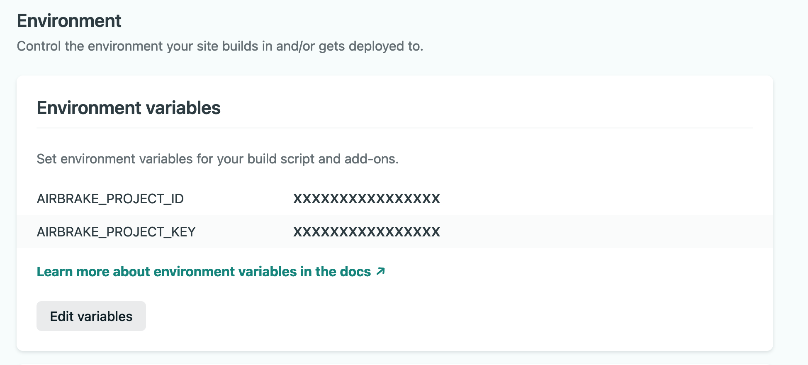

# Airbrake Netlify build plugin

Automatically notify [Airbrake](https://airbrake.io/) of new releases being
deployed to your site after it finishes building in Netlify.

The Airbrake Netlify build plugin:

- Notifies Airbrake of new releases being deployed.
- Sends Airbrake the commit SHA of HEAD to enable commit features.

_You can get more benefits by enabling
[Github Integration](https://airbrake.io/docs/integrations/github/) - Optional_

Make sure build plugins are enabled on your site to see the plugin run.

## Installation

#### UI Installation

To install plugins via the Netlify UI, go to your team sites list and select the
Plugins tab (or follow this direct link to the
[plugins directory](https://app.netlify.com/plugins)). Then find "Airbrake Build
Plugin" and click **Install**.

UI installation is the recommended way to install this Build Plugin unless you
need advanced configuration.

#### File-based Installation

Alternatively, to install with file-based installation, add the following lines
to your `netlify.toml` file:

```toml
[[plugins]]
  package = "@bharathvaj/netlify-plugin-airbrake"

  [plugins.inputs]
    airbrakeProjectId = ""
    airbrakeEnvironment = ""
    airbrakeUsername = ""
    airbrakeUsername= "
```

Note: The `[[plugins]]` line is required for each plugin installed via
file-based installation, even if you have other plugins in your `netlify.toml`
file already.

You can also differentiate the production and deploy preview enviroments using
the
[Netlify's deploy context feature](https://www.netlify.com/blog/2016/08/30/introducing-deploy-contexts-in-netlify/).

### Set Environment Variables in Netlify

Save the internal integration token and any other environment variables as
[site environment variables](https://docs.netlify.com/configure-builds/environment-variables/):

1. In Netlify, go to your site's settings.
2. Click on "Build & deploy".
3. Click “Edit variables” and add `AIRBRAKE_PROJECT_ID` and
   `AIRBRAKE_PROJECT_KEY`. For more configuration options see the
   [environment variables](#environment-variables) section below.
4. Click "Save".



For more information about the parameters below, please see the
[Airbrake API docs](https://airbrake.io/docs/api/#create-deploy-v4).

#### Environment Variables

You can use
[site environment variables](https://docs.netlify.com/configure-builds/environment-variables/)
to configure these values:

| name                         | description        | example        |
| ---------------------------- | ------------------ | -------------- |
| `AIRBRAKE_PROJECT_ID`        | Project Id         | -              |
| `AIRBRAKE_PROJECT_KEY`       | Project Key        | -              |
| `AIRBRAKE_ENVIRONMENT`       | Deploy Environment | production     |
| `AIRBRAKE_DEPLOY_USER_NAME`  | Deploy user name   | john           |
| `AIRBRAKE_DEPLOY_USER_EMAIL` | Deploy user email  | john@smith.com |
| `AIRBRAKE_VERSION`           | Deploy version     | v2             |

#### Plugin Inputs

| name                  | description        | example        |
| --------------------- | ------------------ | -------------- |
| `airbrakeProjectId`   | Project Id         | -              |
| `airbrakeEnvironment` | Deploy Environment | production     |
| `airbrakeUsername`    | Deploy user name   | john           |
| `airbrakeUserEmail`   | Deploy user email  | john@smith.com |
| `airbrakeVersion`     | Deploy version     | v2             |
